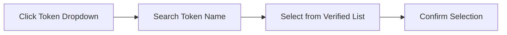

# Getting Started Guide

## Connecting Your Wallet
1. Click the "Connect Wallet" button in the top right corner
2. Select your preferred wallet provider (Phantom, Solflare, etc.)
3. Approve the connection request in your wallet

## Selecting Tokens

## Understanding the Interface
| Component | Description |
|-----------|-------------|
| Input Amount | Enter the token amount you want to swap from |
| Output Estimate | Preview the expected received amount |
| Price Impact | Shows how your swap affects the pool price |

> ℹ️ Always verify token addresses before swapping
