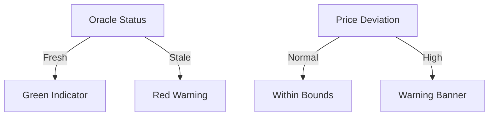

# Security Features Guide

## Real-Time Protection Indicators

## Understanding the Security Panel
| Component | Purpose | Safe Range |
|-----------|---------|------------|
| Deviation Gauge | Price vs TWAP difference | < 2% |
| Oracle Freshness | Last update time | < 5 minutes |
| Liquidity Depth | Available swap volume | > $10,000 |

## Transaction Safety Checks
1. **Preview Screen** shows:
   - Exact amounts to receive
   - All fees breakdown
   - Price impact warning

2. **Wallet Confirmation** displays:
   - Contract being interacted with
   - Maximum slippage amount
   - Estimated network fee

## Best Practices
- Always verify the contract address matches:
  `Hexfz6ziQfSp6gzGRyNf2RAc7akNykz8ggeLqXrKj82s`
- Check for the verified checkmark on tokens
- Review transaction details before signing
