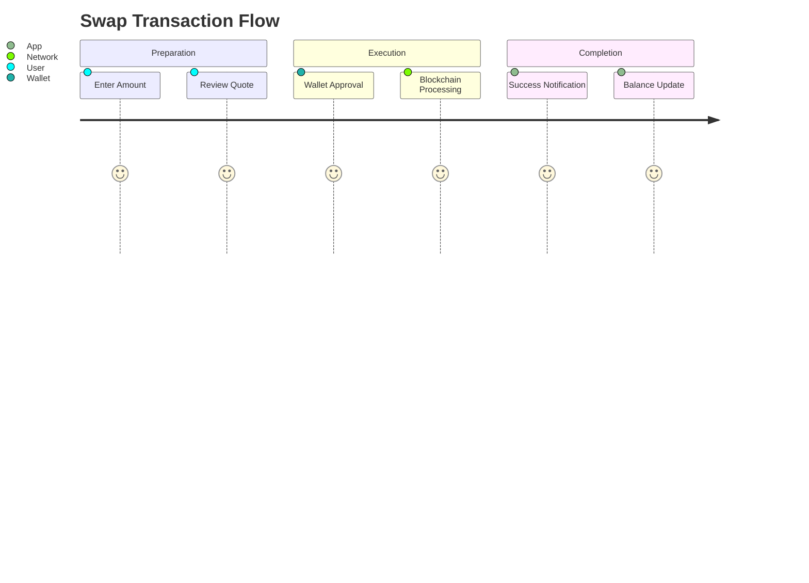

# Swap Execution Guide

## How to Perform a Swap
1. **Enter Amount**: Type the amount you want to swap in the input field
2. **Review Quote**: Check the estimated output amount and price impact
3. **Set Slippage** (Optional): Click settings icon to adjust tolerance
4. **Confirm Swap**: Click the swap button and approve in your wallet

## Understanding Slippage
Slippage tolerance protects you from price movements during transaction processing. We recommend:

| Scenario | Suggested Slippage |
|----------|-------------------|
| Stablecoins | 0.1-0.5% |
| High Liquidity | 0.5-1% |
| Low Liquidity | 1-3% |

## Troubleshooting
- **Failed Transactions**: Try increasing slippage or checking network congestion
- **Pending Transactions**: Check your wallet for pending approvals
- **Insufficient Balance**: Verify you have enough for gas fees
